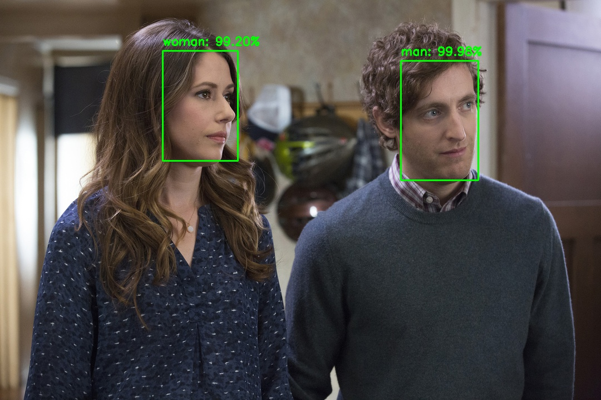

# Gender detection (from scratch) using deep learning with keras and cvlib
The keras model is created by training [SmallerVGGNet](model.png) from scratch on around 2200 face images (~1100 for each class). Face region is cropped by applying `face detection` using `cvlib` on the images gathered from Google Images. It acheived around 96% training accuracy and ~90% validation accuracy. (20% of the dataset is used for validation)

## Update :
Checkout the gender detection functionality implemented in [cvlib](https://github.com/arunponnusamy/cvlib) which can be accessed through a single function call `detect_gender()`. 

## Python packages
* numpy
* opencv-python
* tensorflow
* keras
* requests
* progressbar
* cvlib

Install the required packages by executing the following command.

`$ pip install -r requirements.txt`

**Note: Python 2.x is not supported** 

Make sure `pip` is linked to Python 3.x  (`pip -V` will display this info).

If `pip` is linked to Python 2.7. Use `pip3` instead. 
`pip3` can be installed using the command `sudo apt-get install python3-pip`

Using **Python virtual environment** is highly recommended.

## Usage

### image input
`$ python detect_gender.py -i <input_image>`

### webcam
`$ python detect_gender_webcam.py`

When you run the script for the first time, it will download the pre-trained model from this [link](https://s3.ap-south-1.amazonaws.com/arunponnusamy/pre-trained-weights/gender_detection.model) and place it under `pre-trained` directory in the current path.

(If `python` command invokes default Python 2.7, use `python3` instead)

### Sample output :

## Training
You can download the dataset I gathered from Google Images from this [link](https://s3.ap-south-1.amazonaws.com/arunponnusamy/datasets/gender_dataset_face.zip) and train the network from scratch on your own if you are interested. You can add more images and play with the hyper parameters to experiment different ideas. 

### Additional packages
* scikit-learn
* matplotlib

Install them by typing `pip install scikit-learn matplotlib`

### Usage
Start the training by running the command

`$ python train.py -d <path-to-dataset>`

(i.e) _$ python train.py -d ~/Downloads/gender_dataset_face/_

Depending on the hardware configuration of your system, the execution time will vary. On CPU, training will be slow. After the training, the model file will be saved in the current path as `gender_detection.model`.

If you have an Nvidia GPU, then you can install `tensorflow-gpu` package. It will make things run a lot faster.

## Help
If you are facing any difficulty, feel free to create a new [issue](https://github.com/arunponnusamy/gender-detection-keras/issues) or reach out on twitter [@ponnusamy_arun](https://twitter.com/ponnusamy_arun) .
